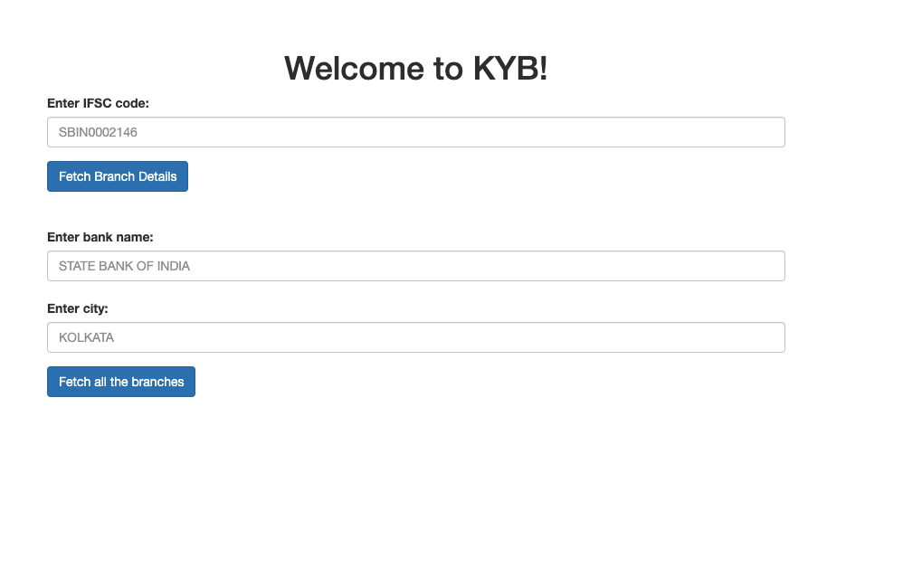
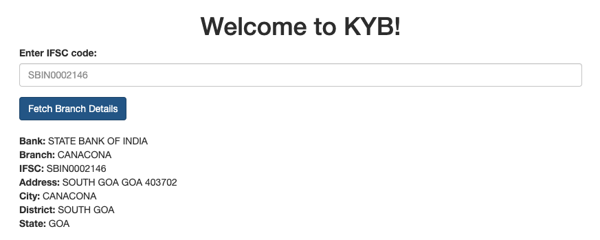
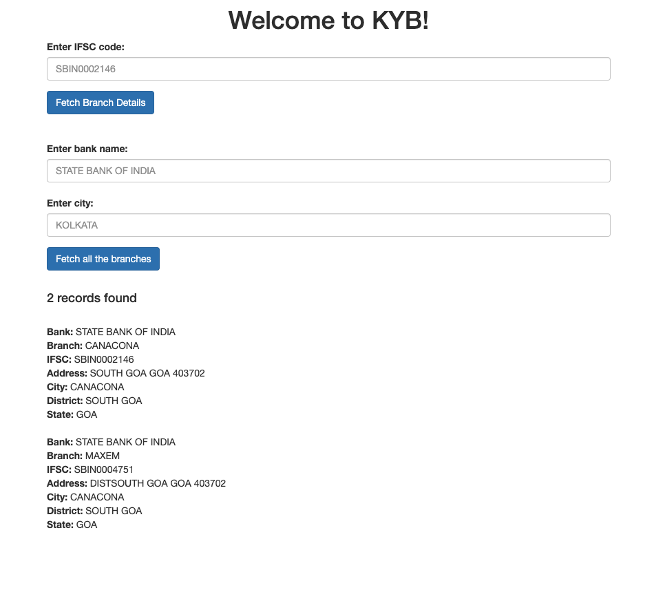

# know-your-bank
A sample Heroku + Postgresql + Flask project to build REST APIs to fetch branch details of a bank.

This app is hosted on [heroku](https://know-your-bank.herokuapp.com).

# description

know-your-bank provides 2 REST endpoints.

- Given an IFSC code, get the branch details
- Given a bank name and city, gets details of all branches of the bank in the city

# prerequisites
- Python 3.7.3  

# execute
```bash
cd know-your-bank
mkvirtualenv -p python3 know-your-bank
pip install -r requirements.txt  
gunicorn know-your-bank:app
```

Open the [url](http://127.0.0.1:8000) in your browser:


Search for branch details given an IFSC code `SBIN0002146`:


Search for branch details given bank name `STATE BANK OF INDIA` and city `CANACONA`:


# references
Data taken from [repository](https://github.com/snarayanank2/indian_banks)

